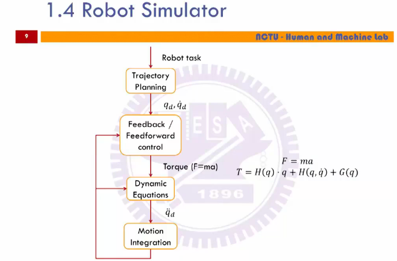

##介绍

> 机器人：有移动性和自主性的系统
>
> 为什么使用机器人：
>
> 1. 减少成本
> 2. 增加产量和质量
> 3. 可以在危险的环境工作
> 4. 不会罢工
> 5. 可以连接互联网

> 机器人擅长：位置控制，又快，又准，又稳。 不擅长：视觉，力控制。 做研究做**位置控制**已经没有什么空间，可以做机器人不擅长的事情，视觉和力控制。**注意：位置控制和力控制的区别，位置控制可能只负责接触到物体，力控制负责控制接触的力度。**

> 常用的期刊杂志

>机器人系统

> 每个自由度一个限制，不然会有无限多的可能，
>
> 平行轴：简单，表达力不够
>
> 旋转轴：复杂，可以表示不同的方位，表达力更强
>
> 驱动方式：直接驱动（马达放到就近位置，如果马达很重没办法解决），齿轮或皮带驱动（把马达放到底座， 比较复杂）

> 机器人模拟器
>
> Feedforwards：提前预测，可能会出现预估错误的问题，提前补偿
>
> Dynamic Equations：计算出达到规划路径的力矩和力，加速度
>
> 运动执行，然后根据当前的运动路径和规划路径 Feedbacks 对规划的行动进行调整。

## 空间表示和转换

> 位置，方位，坐标系
>
> 各个坐标轴坐标系之间的映射（每个轴一个坐标系统）
>
> 坐标轴的转换

- 位置，方位，坐标系

  > 位置向量，w 表示 scale,

> 方位矩阵，本来描述方位的变换对应需要一个  3x3 矩阵（9 个自由度），但是每个方位的长度为 1，且两两方位正交，这就有 6 个约束，所以其实最终也只是有 3 个自由度
>
> 中间那个矩阵的转换没有看明白，说是两个向量想乘是 cosine

> 旋转矩阵的转置矩阵就是逆矩阵
>
> 参考坐标系 A,坐标系 B 可以描述为一个 4x4 的矩阵 

> 空间坐标点在两个坐标轴之间的转换，这个公式很常见

> 空间坐标点的平移，平移可以交换

> 空间坐标点的旋转，旋转不满足交换
>
> 因为三个轴之间是正交的，三个轴之间没有任何关系，所以可以把旋转变为绕每个轴单独旋。左下角的转换表示绕 x 轴旋转

> 总体
>
> 惯例：最在意 z 轴
>
> approach：z 轴的方向，就是机器人要接近目标的方向，绕着 z 轴旋转或绕 z  轴向前移动。
>
> orientation： y 轴的方向
>
> normal：x 的方向

> 前乘法／后乘法，机器人中一般使用后乘法，在后面每乘以一个变换矩阵就变为另外一个坐标轴，
>
> 后乘：参考坐标系统是前一个的坐标系统
>
> 前乘：参考坐标系统是基座或世界坐标系

> ...

